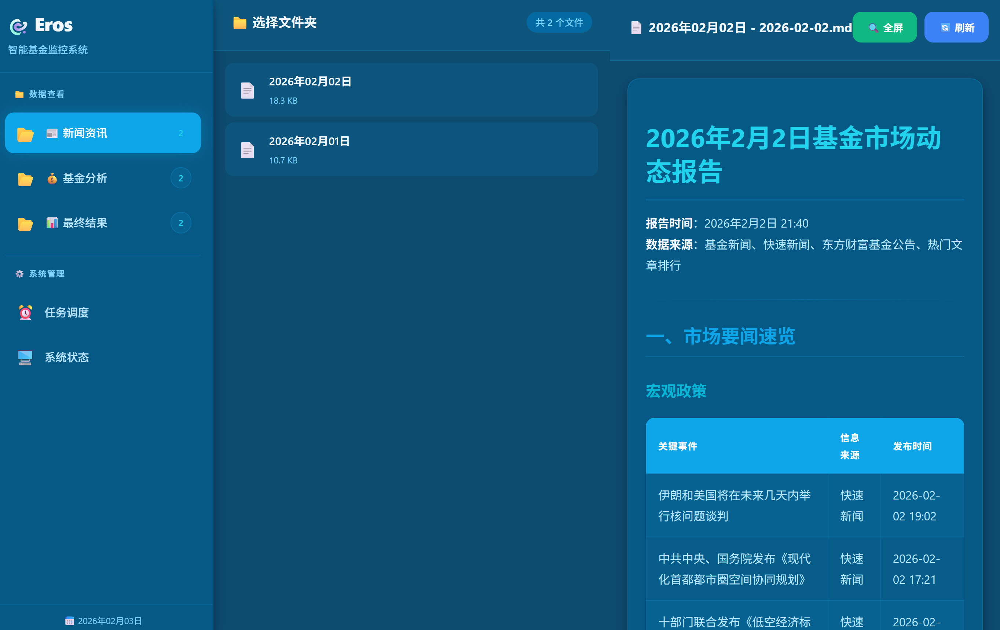
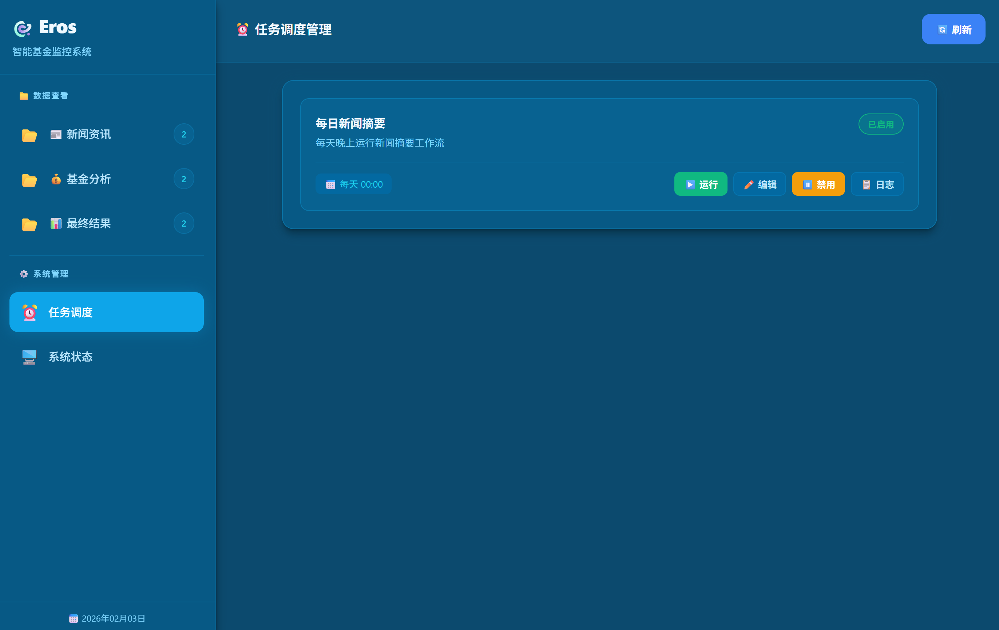
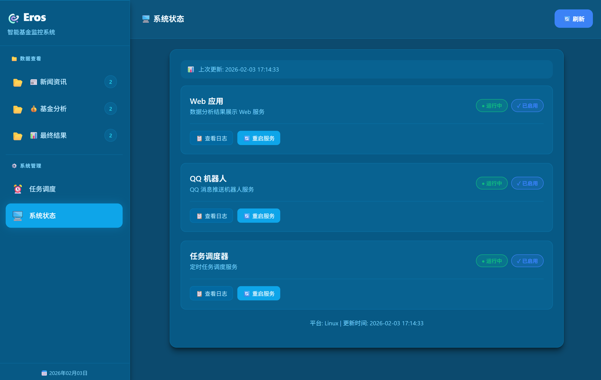

<div align="center">


# Eros - 智能基金监控系统

<p align="center">
  
  
  
  
</p>

<p align="center">
  <b>AI 驱动的智能基金分析与监控系统</b><br/>
  自动化数据收集 · 智能分析 · 实时推送 · Web 可视化
</p>

<p align="center">
  <a href="#快速开始">🚀 快速开始</a> •
  <a href="#功能特性">✨ 功能</a> •
  <a href="#界面预览">📸 预览</a> •
  <a href="#技术栈">🛠️ 技术栈</a> •
  <a href="#部署">📦 部署</a>
</p>

</div>

---

## 📖 项目简介

**Eros** 是一款基于 Python 开发的智能基金监控与分析系统，集成了 AI 智能分析、实时数据收集、定时任务调度和多渠道消息推送等功能。系统采用模块化架构设计，支持通过 Web 界面进行可视化管理和监控。

### 核心能力

- 🧠 **AI 智能分析** - 基于智谱 AI GLM 大模型，提供基金智能评级、市场趋势分析和新闻摘要生成
- 📊 **实时数据监控** - 自动获取基金净值、行业资金流向、市场新闻等多维度数据
- ⏰ **灵活任务调度** - 支持 Cron 表达式、定时/间隔执行，配置文件热重载无需重启
- 📱 **多渠道推送** - QQ 机器人实时推送，支持自定义推送规则和群组管理
- 🌐 **Web 可视化** - 现代化的 Web 管理界面，实时监控任务状态和服务健康度

---

## ✨ 功能特性

<table>
<tr>
<td width="50%">

### 🤖 AI 智能分析
- 基于智谱 AI GLM 大语言模型
- 基金智能分析与评级系统
- 市场新闻自动摘要生成
- 行业资金流向智能解读

</td>
<td width="50%">

### 📊 数据收集
- 基金实时净值数据获取
- 行业资金流向追踪分析
- 多源财经新闻聚合
- 数据可视化图表生成

</td>
</tr>
<tr>
<td width="50%">

### ⏰ 任务调度
- Cron 表达式灵活配置
- 支持定时/间隔执行模式
- 配置文件热重载
- 任务执行日志追踪

</td>
<td width="50%">

### 🔔 消息推送
- QQ 官方机器人实时推送
- 自定义推送规则引擎
- 支持群聊和私聊推送
- AI 对话交互功能

</td>
</tr>
</table>

---

## 📸 界面预览

### Web 管理界面

<div align="center">



<p><i>Web 管理界面 - 实时监控任务状态和服务健康度</i></p>

</div>

### 任务调度中心

<div align="center">



<p><i>任务调度中心 - 可视化配置定时任务和查看执行日志</i></p>

</div>

### 系统控制面板

<div align="center">



<p><i>系统控制面板 - 服务启停管理和一键重启功能</i></p>

</div>

---

## 🛠️ 技术栈

<div align="center">

| 类别 | 技术 |
|:---:|:---|
| **AI 引擎** |  |
| **Web 框架** |   |
| **数据处理** |   |
| **任务调度** |  |
| **前端技术** |    |
| **消息推送** |  |

</div>

---

## 🚀 快速开始

### 环境要求

- Python 3.8+
- Windows / Ubuntu / macOS

### 1️⃣ 克隆项目

```bash
git clone <repository-url>
cd auto_fund
```

### 2️⃣ 创建虚拟环境

```bash
# Windows
python -m venv .venv && .venv\Scripts\activate

# Ubuntu/macOS
python3 -m venv venv && source venv/bin/activate
```

### 3️⃣ 安装依赖

```bash
pip install -r requirements.txt
```

### 4️⃣ 配置环境变量

```bash
cp .env.example .env
# 编辑 .env 文件，填入你的 API 密钥
```

### 5️⃣ 启动服务

```bash
# 方式一：分别启动各服务

# 启动 Web 界面（默认端口 5000）
python web/app.py

# 启动 QQ 机器人
python message_push/QQ/run.py

# 启动任务调度器
python scheduler/scheduler.py

# 方式二：一键启动所有服务（Windows）
scripts\start_all.bat
```

访问 http://localhost:5000 查看 Web 界面

---

## ⚙️ 配置说明

### 环境变量 (.env)

```env
# ==================== 必填配置 ====================

# 智谱 AI API 密钥（用于 AI 分析功能）
# 获取地址：https://open.bigmodel.cn/
ZHIPU_API_KEY=your_zhipu_api_key_here

# ==================== 可选配置 ====================

# QQ 机器人配置（用于消息推送）
# 获取地址：https://q.qq.com/
QQ_BOT_APPID=your_qq_bot_appid
QQ_BOT_SECRET=your_qq_bot_secret

# Web 服务重启密码（保护系统控制功能）
SERVICE_RESTART_PASSWORD=your_secure_password

# 服务器配置
FLASK_HOST=0.0.0.0
FLASK_PORT=5000
FLASK_DEBUG=false
```

### 调度器配置 (scheduler/config.json)

```json
{
  "tasks": [
    {
      "id": "news_summary",
      "name": "每日新闻摘要",
      "command": "python workflow/news_summry/run.py",
      "schedule": {
        "type": "daily",
        "time": "08:00"
      },
      "enabled": true,
      "description": "每天早上8点生成基金新闻摘要"
    },
    {
      "id": "fund_analysis",
      "name": "基金定时分析",
      "command": "python AI/core.py",
      "schedule": {
        "type": "interval",
        "minutes": 60
      },
      "enabled": true,
      "description": "每小时执行一次基金分析"
    }
  ]
}
```

### 支持的调度类型

| 类型 | 说明 | 示例 |
|:---:|:---|:---|
| `daily` | 每日定时 | `"time": "09:30"` |
| `interval` | 间隔执行 | `"minutes": 30` |
| `cron` | Cron 表达式 | `"cron": "0 9 * * 1-5"` |

---

## 📦 部署指南

<details>
<summary><b>🪟 Windows 部署</b></summary>

#### 方法一：启动文件夹（推荐个人使用）

1. 按 `Win + R`，输入 `shell:startup` 打开启动文件夹
2. 将 `scripts/start_all.bat` 的快捷方式复制到启动文件夹
3. 重启电脑测试是否自动启动

#### 方法二：任务计划程序（推荐服务器使用）

1. 按 `Win + R`，输入 `taskschd.msc` 打开任务计划程序
2. 创建基本任务：
   - **触发器**：选择"当用户登录时"或"计算机启动时"
   - **操作**：启动程序 `scripts/start_all.bat`
   - **条件**：取消勾选"只有在计算机使用交流电源时才启动"
3. 完成任务创建

</details>

<details>
<summary><b>🐧 Ubuntu 部署（systemd 服务）</b></summary>

```bash
# 进入脚本目录
cd scripts

# 安装 systemd 服务（需要 root 权限）
sudo ./install_service.sh
```

自动创建以下服务：
- `auto-fund-web.service` - Web 应用服务
- `auto-fund-qq.service` - QQ 机器人服务
- `auto-fund-scheduler.service` - 任务调度器服务

```bash
# 查看服务状态
sudo systemctl status auto-fund-web

# 查看实时日志
sudo journalctl -u auto-fund-web -f

# 重启服务
sudo systemctl restart auto-fund-web

# 停止服务
sudo systemctl stop auto-fund-web

# 卸载服务
sudo ./uninstall_service.sh
```

</details>

<details>
<summary><b>🐳 Docker 部署（可选）</b></summary>

```bash
# 构建镜像
docker build -t eros-fund .

# 运行容器
docker run -d \
  --name eros-fund \
  -p 5000:5000 \
  -v $(pwd)/.env:/app/.env \
  -v $(pwd)/data:/app/data \
  eros-fund
```

</details>


## 🔧 开发指南

### 添加自定义任务

1. 在 `scheduler/config.json` 中添加任务配置
2. 创建任务执行脚本（参考 `workflow/news_summry/run.py`）
3. 重启调度器或等待配置热重载

### 扩展 AI 分析能力

1. 在 `AI/` 目录下创建新的分析模块
2. 继承基础工具类 `AI/default_tool.py`
3. 在配置文件中添加提示词模板

### 自定义消息推送

1. 在 `message_push/` 下创建新的推送渠道目录
2. 实现标准推送接口
3. 在调度任务中调用推送接口

---

## 📋 更新日志

### v1.0.0 (2024-XX-XX)

- ✨ 初始版本发布
- 🤖 集成智谱 AI GLM 模型
- 📊 基金数据实时监控
- ⏰ 任务调度系统
- 📱 QQ 机器人推送
- 🌐 Web 管理界面

---

## 🤝 贡献指南

欢迎提交 Issue 和 Pull Request！

1. Fork 本仓库
2. 创建特性分支 (`git checkout -b feature/AmazingFeature`)
3. 提交更改 (`git commit -m 'Add some AmazingFeature'`)
4. 推送到分支 (`git push origin feature/AmazingFeature`)
5. 创建 Pull Request

---

## 📄 开源协议

本项目基于 [MIT](LICENSE) 协议开源。

---

<div align="center">

### 🌟 Star 历史

[](https://star-history.com/#yourname/auto_fund&Date)

---

**Made with ❤️ by Eros Team**

<p align="center">
  <a href="https://github.com/yourname/auto_fund">
    
  </a>
</p>

</div>
